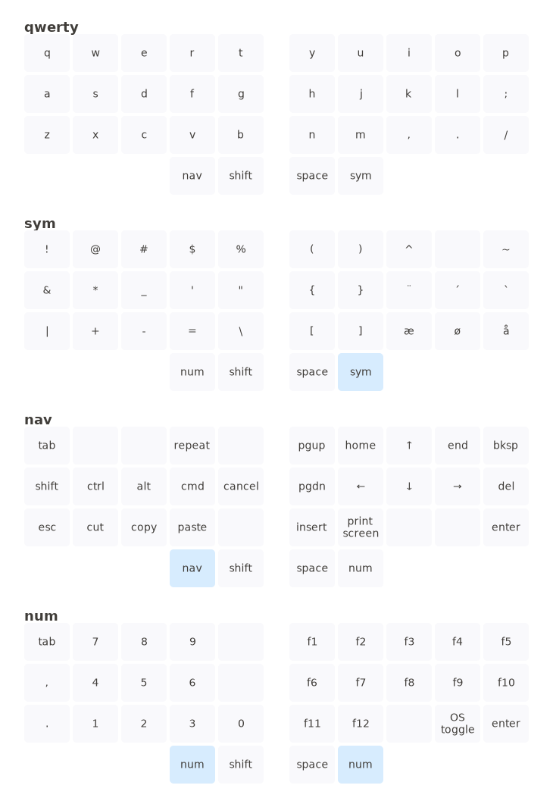

# Create-KeymapSVG

This is my take on a keymap svg create thingy. It's based on the great work by [callum-oakley/keymap](https://github.com/callum-oakley/keymap) and [caksoylar/keymap](https://github.com/caksoylar/keymap).    

I use PowerShell a lot more than python, so I converted it to PowerShell and simplified it a bit. The input file format is json. The json file contains information about the layout of the keyboard, the different layers and the keys.


## Supported layouts
The script supports ortho keymaps and split keymaps (with and without thumb keys). Keys kan be more tha 1u wide on any row.

## Get started

Install PowerShell. If you are running Windows you probably already got a recent version of PowerShell. You can find [install guide for PowerShell on MacOS and linux](https://learn.microsoft.com/en-us/powershell/scripting/install/installing-powershell).

Create a json file for you keymap - see the [sample layouts](json/layout_4x12.json).

## Run the script

```
Create-KeymapSVG.ps1 -KeymapJsonFile <pathToJsonFile> -OutputSVGFile <pathToSVGOutputFile> [ -PrintLayerName ]
```

The param `-printLayerName` prints the name of the keyboard layer as heading (see [sample outputs](svg/keymap_3x5_2.svg))

## Sample output

This svg file is created from the file [json/layout_3x5_2.json](json/layout_3x5_2.json)


## The json file
The basic json file format is like this:

```json
{
    "layout": {
        "split": false,
        "rows": 4,
        "columns": 10
    },
    "layers": {
        "qwerty": {
            "keys": [
                ["q", "w", "f", "p", "g","j", "l", "u", "y", "'"],
                ["a", "r", "s", "t", "d","h", "n", "e", "i", "o"],
                ["z", "x", "c", "v", "b","k", "m", ",", ".", ";"],
                ["shift", "ctrl", "alt", "gui", "","", "left", "down", "up", "right"]
            ]
        },
        "sym": {
            "keys": [
                ["!", "@", "#", "$", "%","(", ")", "^", null, "~"],
                ["&", "*", "_", "'", "\"","{", "}", "¨", "´", "`"],
                ["|", "+", "-", "=", "\\","[", "]", "æ", "ø", "å"],
                [null, null, null, "gui", "","", "left", "down", "up", "right"]
            ]
        }
    }
}
```

NOTE: If split is `true` then rows,columns and thumbs are number of rows/columns/thumbs for one half.    

Any keys you wish to have blank legend should be given the `null` value. Keys next to each other in the same row with the same legend will be merged to one. So to create a 2u spacebar you just create two keys with the same legend - like: `"space","space"`or `"",""` (`null` keys are not merged).    

It's also posible to add a style (css) class to the key in the format `"stylename::legend"`. You will have to add the css to the `<style>...</style>` section of the svg output after it's created (the `hold` class is included and is styled with color).

__Remember to save the json file with UTF-8 encoding!__
